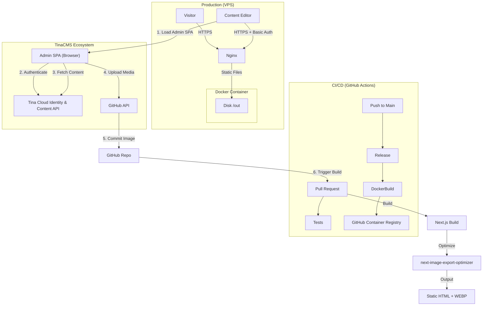

# System Architecture

## Overview

The DPSG Wehr website is a **Statically Generated (SSG)** Next.js application designed for high performance, low maintenance, and easy hosting. It uses **TinaCMS** for content management, but with a unique "Split Brain" architecture to balance the convenience of Tina Cloud with the requirement for self-hosted, optimized images.

## Architecture Diagram



## The "Hybrid" CMS Configuration

We use TinaCMS in a hybrid mode. Standard Tina Cloud setups host both content and media. We split this:

| Feature            | Provider             | Reason                                                                                                                        |
| :----------------- | :------------------- | :---------------------------------------------------------------------------------------------------------------------------- |
| **Authentication** | Tina Cloud           | Easy login, role management, secure.                                                                                          |
| **Content (MDX)**  | Tina Cloud           | API-based editing, Git syncing, no local backend needed in prod.                                                              |
| **Media (Images)** | **Custom Git Store** | Tina Cloud images (`assets.tina.io`) cannot be optimized by `next-image-export-optimizer` at build time. We need local paths. |

### 1. The Custom Media Store (`tina/git-media-store.ts`)

Instead of uploading to Tina Cloud, our custom store:

1.  Accepts a file upload in the CMS.
2.  Uses the **GitHub API** (via a Personal Access Token) to PUT the file directly into `public/media/...`.
3.  Returns the **Local Path** (e.g., `/media/images/camp.jpg`) to the CMS.
4.  Provides a `raw.githubusercontent.com` URL for the CMS preview.

**Result:** The MDX file saved to Git looks like this:

```yaml
image: /media/images/camp.jpg
```

This allows our build pipeline to see the file locally and generate optimized `WEBP` versions.

### 2. Security Model

The Custom Media Store runs in the **browser**. This means it needs the `GITHUB_TOKEN` to be available client-side.

- **Risk:** If the `/admin` page is public, anyone can view source and steal the Token.
- **Mitigation:** We protect the `/admin` route with **Nginx Basic Auth**.
    - The credentials live in `.htpasswd` on the VPS.
    - Only authorized users can even load the JavaScript that contains the token.

## Build Pipeline (CI vs. Production)

### Local / CI Build (`TINA_PUBLIC_IS_LOCAL=true`)

When running `pnpm build:ci` (in GitHub Actions) or `pnpm dev`:

- **Tina Mode:** Local.
- **Content Source:** Local filesystem (via a local GraphQL server running on port 4001).
- **Auth:** Disabled (`--skip-cloud-checks`).
- **Goal:** Verify that the _current code and content on disk_ builds correctly.

### Production Build (`TINA_PUBLIC_IS_LOCAL=false`)

When running on the VPS or targeting production:

- **Tina Mode:** Production.
- **Content Source:** Tina Cloud (for the Admin SPA configuration).
- **Static Generation:** Still builds from the _files on disk_ (checked out from Git).
- **Goal:** Produce the static HTML and the Admin SPA configured to talk to Tina Cloud.

## Deployment Workflow

1.  **Code Change:** Push to `main`.
2.  **Semantic Release:** Bumps version, updates `CHANGELOG.md`.
3.  **Docker Build:** Builds the `website-dpsg-wehr` image (Standard `node:22` build -> Nginx image).
4.  **Webhook:** The VPS receives a webhook (via Watchtower or custom script).
5.  **Deploy:** `docker compose up -d`.

## Developer Setup

### Prerequisites

- Node.js 22+
- pnpm 10+
- Docker (optional, for local prod testing)

### Local Development

1.  `cp .env.example .env` (Ask lead dev for values).
2.  `pnpm install`
3.  `pnpm dev`
    - Starts Next.js on `3000`.
    - Starts Tina Local Server on `4001`.
    - Starts Tina Datalayer on `9000` (ensure port is free!).

### VPS Setup

1.  Clone repo.
2.  Run `./scripts/setup-vps.sh` to generate `.env` and `.htpasswd`.
3.  Add `NEXT_PUBLIC_GITHUB_TOKEN` to `.env`.
4.  `docker compose up -d`.
